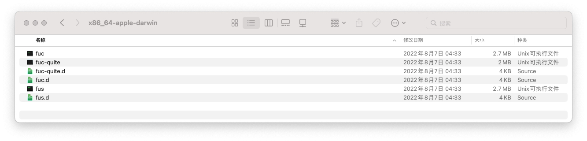
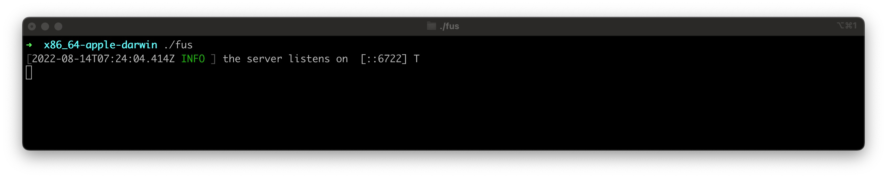
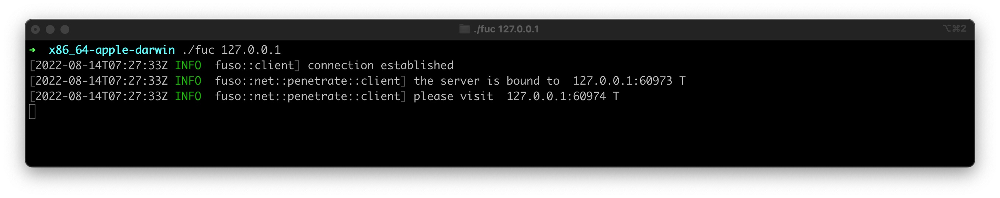

# Fuso : 扶桑

A fast, stable, cross-platform and efficient intranet penetration and port forwarding tool

一款 快速 稳定 跨平台 高效的内网穿透,端口转发工具

[](https://github.com/editso)
[](https://github.com/B1eed)
[](https://github.com/ifishzz)
[](https://github.com/editso/fuso/releases)
[](https://github.com/editso/fuso/issues)
[](https://github.com/editso/fuso)
[](https://github.com/editso/fuso)
[](https://github.com/editso/fuso)
[](https://github.com/editso/fuso/releases/latest)

### 待完善
1. webhook
2. web管理面板
3. 正向代理
4. 流转发
5. 文档修正

### 快速开始
1. [下载fuso](https://github.com/editso/fuso/releases/latest)

2. 解压,得到 `fus`,`fuc`两个程序, 将`fus`上传到你的服务器, 将`fuc`放到你需要穿透的电脑上
   

3. 在你的服务器上启动`fus` 如下图,则表示服务端启动成功  
   
   1. *默认情况下,服务端监听6722端口*  

4. 在你需要穿透的电脑上启动`fuc` 如下图, 则表示客户端启动成功
   
   1. *默认情况下,将转发到`127.0.0.1:80`, 访问端口将随机分配*

5. 此时访问`127.0.0.1:60974`即可, 注意: 你的`80`端口必须有服务在运行

### 使用说明
```
1. 端口转发
fuc --forward-host xxx.xxx.xxx.xxx --forward-port
   --forward-host: 转发到的地址
   --forward-port: 转发到的端口
   如: 转发流量到内网 10.10.10.4:3389
   > fuc --forward-host 10.10.10.4 --forward-port 33389

2. socks5:
fuc --socks --su --s5p xxx --s5u xxx
   --su: 可选的, 开启udp转发, 
   --s5p: 可选的, 认证密码, 默认不进行密码认证
   --s5u 可选的, 认证账号, 默认账号 anonymous
   --socks: 可选的, 开启socks5代理, 未指定--su的情况下不会转发udp
   如: 开启udp转发与密码认证
   > fuc --socks --su --s5p 123 --s5u socks
   此时, 已开启udp转发,连接密码为 "123",账号为 "socks"

3. 指定穿透成功时访问的端口
   fuc -b xxxx
   -b | --visit-bind-port: 可选的, 默认随机分配
   如: 访问外网端口 8888 转发到内网 80
   > fuc --forward-port 80 -b 8888
   
4. 桥接模式 注意: 目前不能转发udp
   fuc --bridge-listen xxxx --bridge-port xxx 
   --bridge-listen | --bl: 监听地址, 默认 127.0.0.1
   --bridge-port | --bp: 监听端口, 默认不启用桥接
   如: 开始桥接模式,并监听在9999端口, 本机ip地址为: 10.10.10.2
   > fuc --bridge-listen 0.0.0.0 --bridge-port 9999 # 开启桥接
   > fuc 10.10.10.2 9999 # 建立连接

   级联: 
   > fuc --bridge-listen 0.0.0.0 --bridge-port 9999 # 第一级, IP: 10.10.10.2
    > fuc --bridge-listen 0.0.0.0 --bridge-port 9991  10.10.10.2 9999 # 第二级, IP: 10.10.10.3
     > fuc 10.10.10.3 9991 # 最终 

5. 将连接信息通知到 Telegram 或其他
   fus --observer "program:[arguments]"
   --observer: 建立连接或断开连接时的钩子
   如: 使用bash脚本将连接信息通知到tg
   > fus --observer "/bin/bash:[telegram.sh]"


```


### Demo


### Features

| Name            | <font color="green">✔(Achieved)</font> / <font color="red">❌(Unrealized)</font>) |
| --------------- | --------------------------------------------------------------------------------- |
| 基本转发        | <font color="green">✔</font>                                                      |
| 传输加密        | <font color="green">✔</font>                                                      |
| socks5          | <font color="green">✔</font>                                                      |
| socks5 udp 转发 | <font color="green">✔</font>                                                      |
| kcp 支持        | <font color="green">✔<font>                                                       |
| 多映射          | <font color="green">✔</font>                                                      |
| 级联代理        | <font color="green">✔</font>                                                      |
| 数据传输压缩    | <font color="green">✔</font>                                                      |
| websocket       | <font color="">❌</font>                                                      |
| `Rsa`加密       | <font color="green">✔</font>                                                      |
| `Aes`加密       | <font color="green">✔</font>                                                      |


### External

- kcp: [https://github.com/Matrix-Zhang/kcp](https://github.com/Matrix-Zhang/kcp)
- lz4: [https://github.com/lz4/lz4](https://github.com/lz4/lz4)

### 注意

- 本项目所用技术**仅用于学习交流**，**请勿直接用于任何商业场合和非法用途**。
