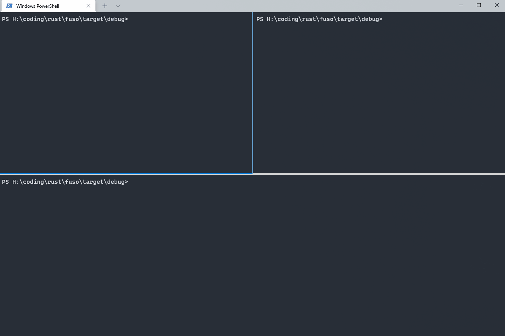

# Fuso : 扶桑

A fast, stable, cross-platform and efficient intranet penetration and port forwarding tool

一款 快速 🚀 稳定 跨平台 高效的内网穿透，端口转发工具

[](https://github.com/editso)
[](https://github.com/B1eed)
[](https://github.com/ifishzz)
[](https://github.com/editso/fuso/releases)
[](https://github.com/editso/fuso/issues)
[](https://github.com/editso/fuso)
[](https://github.com/editso/fuso)
[](https://github.com/editso/fuso)
[](https://github.com/editso/fuso/releases/latest)

### ✨Demo



### 👀 如何使用 (How to use) ❓

1. 你需要先[下载](https://github.com/editso/fuso/releases/latest)或[构建](#Build)`Fuso`
2. `fuso` 分为客户端(`fuc`)与服务端(`fus`)
3. 将你下载或构建好的`fus`程序[部署](#服务端部署)到服务器
4. 将你下载或构建好的`fuc`程序[部署](#客户端部署)到你需要穿透的电脑上

#### 服务端部署

1. 采用参数传递的形式来部署无需任何配置文件, 并且配置简单大多情况下可使用默认配置

2. **服务端参数说明**  
   fus [options]  
   -l, --listen <LISTEN> 监听的地址 [default: 0.0.0.0]  
   -p, --port <PORT> 监听的端口 [default: 6722]  
   --heartbeat-delay <HEARTBEAT_DELAY> 发送心跳延时 [default: 30]  
   --log-level <LOG_LEVEL> 日志级别 [default: info]  
   -h, --help Print help information

#### 客户端部署

1. 客户端配置相对服务端来说可能会复杂一点, 但大多数情况下也可使用默认配置

2. **客户端参数说明**  
   fuc [options] <server-host> <server-port>  
   `<server-host>`: 服务端地址, 支持域名  
   `<server-port>`: 服务端监听的端口, 默认使用 6722  
   `--name` | `-n`: 穿透服务名称  
   `--socks`: 启用`socks5`，默认不开启  
   `--socks-udp` | `--su`: 启用`socks5 udp`转发，默认不开启  
   `--socks-username` | `--s5u`: `socks5`认证时的账号, 默认 `anonymous`  
   `--socks-username` | `--s5p`: `socks5`认证时的密码，默认不进行认证  
   `--bridge-listen` | `--bl` : 桥接监听地址，注意: 桥接目前不支持`udp`转发  
   `--bridge-port` | `--bp`: 桥接监听端口  
   `--forward-host` | `--fh`: 穿透转发地址, 默认 `127.0.0.1`  
   `--forward-port` | `--fp`: 穿透转发端口, 默认 `80`  
   `--visit-bind-port` | `--bind` | `-b`: 穿透访问端口, 默认随机  
   `--log-level`: 日志级别

```
# 一个转发例子
# 服务端绑定在 xxx.xxx.xxx.xxx:9003
# 转发内网中 10.10.10.8:80 到 xxx.xxx.xxx.xxx:8080
# 需要注意的是:
# 10.10.10.8 必须是能 ping 通的
# 80 端口必须有服务在运行
# 服务端已经在运行,并且服务端80端口没有被占用

# 运行:
> fuc 10.10.10.8 80 -b 8080 --fh xxx.xxx.xxx.xxx --fp 9003

# 该命令运行后既可以是转发模式, 也可以是Socks5模式都可以使用8080端口进行访问


# 一个桥接例子
# 什么时候能用到桥接模式呢?
# 比如:
#  你的内网中只有一台机器可以出网, 但是我想访问不能出网机器上所运行的服务
#  那么此时就可以使用桥接模式, 通过可以在出网的机器上开启桥接模式来转发不能出网的服务
#  前提是你不能出网的机器和可以出网的机器在同一个内网中, 并且可以相互 ping 通

# 在可以出网的机器上开启桥接 (0.0.0.0:9004)
# 假设可以出网的内网ip地址为 10.10.10.5
# 运行:
> fuc 10.10.10.8 80 -b 8080 --bl 0.0.0.0 --bp 9004 xxx.xxx.xxx.xxx 9003

# 在不可以出网的机器上需要穿透80服务, 并且服务端监听8081端口
# 此时fuc的服务端地址就不应该是服务器地址, 因为并不能出网, 所以需要连接到开启桥接服务的地址
# 运行:
> fuc 127.0.0.1 80 -b 8081 --fh 10.10.10.5 --fp 9004

```

### Features

| Name            | <font color="green">✔(Achieved)</font> / <font color="red">❌(Unrealized)</font>) |
| --------------- | --------------------------------------------------------------------------------- |
| 基本转发        | <font color="green">✔</font>                                                      |
| 传输加密        | <font color="green">✔</font>                                                      |
| socks5          | <font color="green">✔</font>                                                      |
| socks5 udp 转发 | <font color="green">✔</font>                                                      |
| kcp 支持        | <font color="green">✔<font>                                                       |
| 多映射          | <font color="green">✔</font>                                                      |
| 级联代理        | <font color="green">✔</font>                                                      |
| 数据传输压缩    | <font color="green">✔</font>                                                      |
| websocket       | <font color="">❌</font>                                                      |
| `Rsa`加密       | <font color="green">✔</font>                                                      |
| `Aes`加密       | <font color="green">✔</font>                                                      |


### External

- kcp: [https://github.com/Matrix-Zhang/kcp](https://github.com/Matrix-Zhang/kcp)
- lz4: [https://github.com/lz4/lz4](https://github.com/lz4/lz4)

### 注意

- 本项目所用技术**仅用于学习交流**，**请勿直接用于任何商业场合和非法用途**。